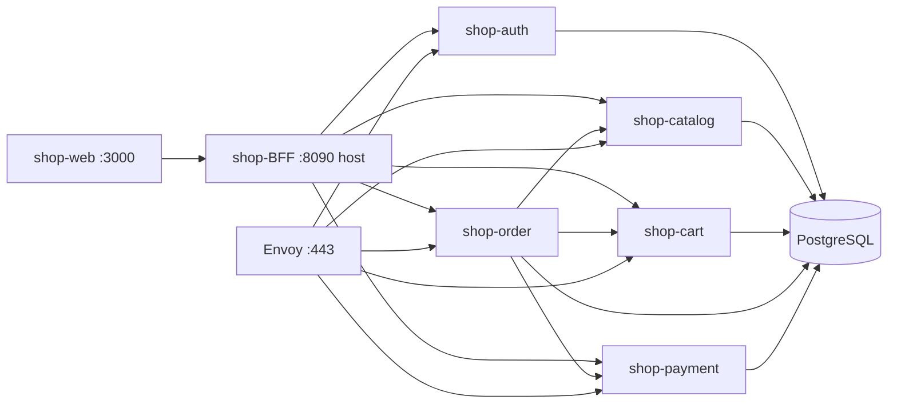

# Nocturne Shop — монорепо (демо)

Монорепозиторий интернет-магазина **Nocturne**: gRPC-микросервисы на Go, BFF, React-фронт, PostgreSQL.  
Собран для демонстрации — чтобы любой мог быстро поднять весь стек локально.

## Структура

```
Nocturne/
├── shop-proto/      gRPC-контракты (protobuf)
├── shop-infra/      Docker Compose, Postgres, Envoy, миграции
├── shop-auth/       аутентификация, JWT
├── shop-catalog/    каталог товаров
├── shop-cart/       корзина
├── shop-order/      заказы
├── shop-payment/    оплата
├── shop-BFF/        HTTP API для фронта
└── shop-web/        React + Vite UI
```

## Требования

- Docker и Docker Compose v2
- Go 1.26+ — только если запускаете сервисы вне Docker

## Быстрый старт

Из корня монорепо:

```bash
make init      # .env из шаблонов (shop-infra + сервисы)
make up        # postgres + все сервисы + bff + web
make migrate   # миграции БД (после первого up, когда postgres готов)
```

Или из `shop-infra` напрямую — те же команды, см. [shop-infra/README.md](shop-infra/README.md).

После запуска:

| Что | URL |
|-----|-----|
| UI | http://localhost:3000 |
| BFF (HTTP API) | http://localhost:8090/health |
| Adminer (БД) | http://localhost:8089 |
| Envoy (gRPC gateway) | `:443` |

### Checkout flow (E2E)

1. Регистрация / логин на http://localhost:3000
2. Добавить товары в корзину
3. Оформить заказ (`CreateOrder`)
4. Оплатить или отменить заказ

## Команды (корень)

| Команда | Описание |
|---------|----------|
| `make init` | Создать `.env` и `env/*.env` из шаблонов |
| `make up` | Поднять весь стек |
| `make down` | Остановить контейнеры |
| `make migrate` | Миграции всех сервисов |
| `make logs` | Логи compose |
| `make infra-up` | Только Postgres + Adminer |

## Порты сервисов

| Сервис | Порт |
|--------|------|
| shop-BFF | 8090 (host) → 8080 (контейнер) |
| shop-auth | 8081 |
| shop-catalog | 8082 |
| shop-cart | 8083 |
| shop-order | 8084 |
| shop-payment | 8086 |
| shop-web | 3000 |
| PostgreSQL | 5432 |

Подробнее: [shop-infra/docs/ports.md](shop-infra/docs/ports.md).

## Архитектура



## Документация сервисов

- [shop-infra](shop-infra/README.md) — compose, env, миграции
- [shop-proto](shop-proto/README.md) — protobuf-контракты
- [shop-auth](shop-auth/README.md)
- [shop-catalog](shop-catalog/README.md) — каталог
- [shop-cart](shop-cart/README.md)
- [shop-order](shop-order/README.md)
- [shop-payment](shop-payment/README.md)
- [shop-BFF](shop-BFF/README.md)
- [shop-web](shop-web/README.md)

## Локальная разработка одного сервиса

Каждый сервис — отдельный Go-модуль со своим `Makefile` и `.env.example`.  
Общий proto: `shop-proto`.  
Для полного стека удобнее `make up` из корня.
