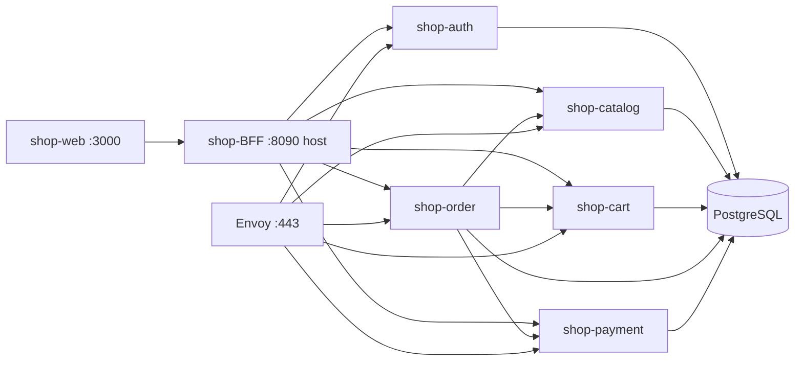

# Nocturne Shop — монорепо (демо)

Монорепозиторий интернет-магазина **Nocturne**: gRPC-микросервисы на Go, BFF, React-фронт, PostgreSQL.  
Собран для демонстрации — чтобы любой мог быстро поднять весь стек локально.

## Структура

```
Nocturne/
├── shop-proto/      gRPC-контракты (protobuf)
├── shop-infra/      Docker Compose, Postgres, Envoy, миграции
├── shop-auth/       аутентификация, JWT
├── shop-catalog/    каталог товаров
├── shop-cart/       корзина
├── shop-order/      заказы
├── shop-payment/    оплата
├── shop-BFF/        HTTP API для фронта
└── shop-web/        React + Vite UI
```

## Быстрый старт

### 1. Требования

- Docker и Docker Compose v2

### 2. Запуск (из корня монорепо)

```bash
make init      # .env и env/*.env из шаблонов (первый раз)
make up        # postgres + все сервисы + bff + web
make migrate   # миграции БД (после up, когда postgres готов)
```

Первый `make up` может занять несколько минут — идёт сборка образов.

Остановка:

```bash
make down
```

### 3. Проверка, что всё работает

| Что проверить | URL | Ожидаемый результат |
|---------------|-----|---------------------|
| BFF жив | http://localhost:8090/health | `{"status":"ok"}` |
| Каталог (API) | http://localhost:8090/api/v1/products | JSON со списком товаров |
| UI магазина | http://localhost:3000 | Страница каталога Nocturne |
| Adminer (БД) | http://localhost:8089 | Вход: `shop` / `shop` |

Через терминал:

```bash
curl http://localhost:8090/health
curl http://localhost:8090/api/v1/products
```

> BFF — JSON API, не веб-страница. На http://localhost:8090/ будет 404 — это нормально.  
> BFF с хоста на порту **8090** (`BFF_HTTP_PORT` в `shop-infra/.env`). UI на `:3000` ходит в BFF через docker-сеть.

### 4. Попробовать сценарий

1. Открыть http://localhost:3000
2. Зарегистрироваться / войти
3. Добавить товар в корзину
4. Оформить заказ → оплатить или отменить

Подробнее: [shop-infra/README.md](shop-infra/README.md)

## Требования (локальная разработка)

- Go 1.26+ — только если запускаете сервисы вне Docker

## Команды (корень)

| Команда | Описание |
|---------|----------|
| `make init` | Создать `.env` и `env/*.env` из шаблонов |
| `make up` | Поднять весь стек |
| `make down` | Остановить контейнеры |
| `make migrate` | Миграции всех сервисов |
| `make logs` | Логи compose |
| `make infra-up` | Только Postgres + Adminer |

## Порты сервисов

| Сервис | Порт |
|--------|------|
| shop-BFF | 8090 (host) → 8080 (контейнер) |
| shop-auth | 8081 |
| shop-catalog | 8082 |
| shop-cart | 8083 |
| shop-order | 8084 |
| shop-payment | 8086 |
| shop-web | 3000 |
| PostgreSQL | 5432 |

Подробнее: [shop-infra/docs/ports.md](shop-infra/docs/ports.md).

## Архитектура



## Документация сервисов

- [shop-infra](shop-infra/README.md) — compose, env, миграции
- [shop-proto](shop-proto/README.md) — protobuf-контракты
- [shop-auth](shop-auth/README.md)
- [shop-catalog](shop-catalog/README.md) — каталог
- [shop-cart](shop-cart/README.md)
- [shop-order](shop-order/README.md)
- [shop-payment](shop-payment/README.md)
- [shop-BFF](shop-BFF/README.md)
- [shop-web](shop-web/README.md)

## Локальная разработка одного сервиса

Каждый сервис — отдельный Go-модуль со своим `Makefile` и `.env.example`.  
Общий proto: `shop-proto`.  
Для полного стека удобнее `make up` из корня.
