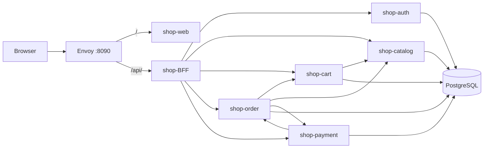

# Nocturne Shop — монорепо (демо)

Монорепозиторий интернет-магазина **Nocturne**: gRPC-микросервисы на Go, BFF, React-фронт, PostgreSQL, Envoy.  
Собран для демонстрации — чтобы любой мог быстро поднять весь стек локально.

**Go:** 1.26.3 · **shop-proto:** `v0.2.6` (Ed25519 JWT в `shop-proto/pkg/auth`)

## Структура

```
Nocturne/
├── shop-proto/      gRPC-контракты, сгенерированный Go-код, JWT/interceptor
├── shop-infra/      Docker Compose, Postgres, Envoy, миграции
├── shop-auth/       регистрация, логин, выдача JWT
├── shop-catalog/    каталог, остатки, резервирование
├── shop-cart/       корзина
├── shop-order/      заказы (checkout: cart + catalog + payment)
├── shop-payment/    оплата
├── shop-BFF/        HTTP JSON API для фронта
└── shop-web/        React 19 + Vite UI
```

## Быстрый старт

### 1. Требования

- Docker и Docker Compose v2
- OpenSSL (для JWT-ключей)

### 2. JWT-ключи (Ed25519, один раз)

```bash
mkdir -p ~/.shop-keys
openssl genpkey -algorithm ED25519 -out ~/.shop-keys/private.pem
openssl pkey -in ~/.shop-keys/private.pem -pubout -out ~/.shop-keys/public.pem
chmod 600 ~/.shop-keys/private.pem
```

| Файл | Кто использует |
|------|----------------|
| `private.pem` | shop-auth (подпись токенов) |
| `public.pem` | auth, catalog, cart, order, payment (проверка) |

В `shop-infra/.env` укажи `JWT_KEYS_DIR=~/.shop-keys` (см. `.env.example`).

### 3. Env-файлы и запуск

```bash
make init      # shop-infra/.env и shop-infra/env/*.env из шаблонов

# .env сервисов (compose читает их при сборке)
for d in shop-auth shop-cart shop-catalog shop-order shop-payment shop-BFF; do
  test -f "$d/.env" || cp "$d/.env.example" "$d/.env"
done

make up        # postgres + сервисы + bff + web + envoy
make migrate   # миграции БД (после up, когда postgres готов)
```

Первый `make up` может занять несколько минут — идёт сборка образов.

Остановка:

```bash
make down
```

### 4. Проверка, что всё работает

**Один адрес** — UI и API через Envoy:

| Что проверить | URL | Ожидаемый результат |
|---------------|-----|---------------------|
| UI магазина | http://localhost:8090 | Каталог Nocturne |
| BFF health | http://localhost:8090/health | `{"status":"ok"}` |
| Каталог (API) | http://localhost:8090/api/v1/products | JSON со списком товаров |
| Adminer (БД) | http://localhost:8089 | Вход: `shop` / `shop` |
| Envoy admin | http://localhost:9901 | Статистика Envoy |

```bash
curl http://localhost:8090/health
curl http://localhost:8090/api/v1/products
```

### 5. Попробовать сценарий

1. Открыть http://localhost:8090
2. Зарегистрироваться / войти
3. Добавить товар в корзину
4. Оформить заказ → оплатить или отменить

Подробнее: [shop-infra/README.md](shop-infra/README.md)

## Требования (локальная разработка)

- Go 1.26.3 — если запускаете сервисы вне Docker
- Node 22 — если собираете shop-web локально

## Команды (корень)

| Команда | Описание |
|---------|----------|
| `make init` | Создать `shop-infra/.env` и `shop-infra/env/*.env` из шаблонов |
| `make up` | Поднять весь стек |
| `make down` | Остановить контейнеры |
| `make migrate` | Миграции auth, catalog, cart, order, payment |
| `make logs` | Логи compose |
| `make infra-up` | Только Postgres + Adminer |
| `make seed` | Seed через `shop-seed` (если репозиторий рядом) |

## Порты (host)

| Сервис | Порт |
|--------|------|
| **Envoy (UI + API)** | 8090 |
| Envoy gRPC gateway | 8443 |
| Envoy admin | 9901 |
| Adminer | 8089 |
| PostgreSQL | 5432 |

gRPC-сервисы с хоста не проброшены — только через Envoy `:8443`.  
Подробнее: [shop-infra/docs/ports.md](shop-infra/docs/ports.md).

## Базы данных

| БД | Сервис |
|----|--------|
| auth_db | shop-auth |
| catalog_db | shop-catalog |
| cart_db | shop-cart |
| order_db | shop-order |
| payment_db | shop-payment |

## Архитектура



Access JWT подписывает **shop-auth**, проверяют backend-сервисы через **shop-proto/pkg/auth** (Ed25519, общий `public.pem`).

## Документация сервисов

- [shop-infra](shop-infra/README.md) — compose, env, миграции, JWT
- [shop-proto](shop-proto/README.md) — protobuf-контракты, `pkg/auth`
- [shop-auth](shop-auth/README.md)
- [shop-catalog](shop-catalog/README.md)
- [shop-cart](shop-cart/README.md)
- [shop-order](shop-order/README.md)
- [shop-payment](shop-payment/README.md)
- [shop-BFF](shop-BFF/README.md)
- [shop-web](shop-web/README.md)

## Локальная разработка одного сервиса

Каждый backend — отдельный Go-модуль с `Makefile` и `.env.example`.  
Общий контракт и JWT: [shop-proto](shop-proto/README.md).  
Для полного стека удобнее `make up` из корня.
